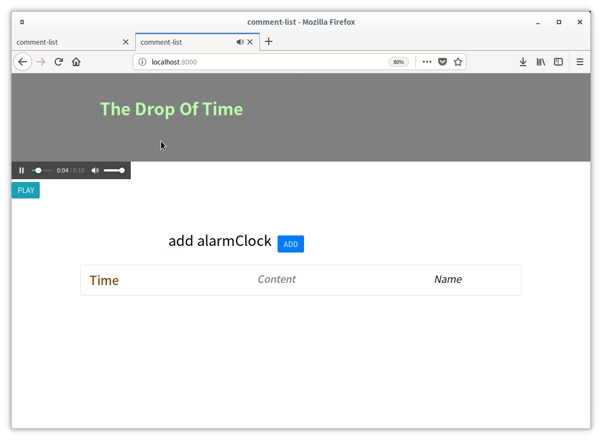

基于nodejs编写的长得像闹钟的铃声系统。
An alarm clock written by nodejs .

运行这个程序你需要nodejs和mplayer。

run this program you should have nodejs and mplayer

然后运行

than run

```
# npm run set    // download something it will need
# npm start
```

然后访问 http://localhost:8000/

then visit http://localhost:8000/


你和以重置TA通过

you can reset it by

```
# npm run clean
```





音乐是我编的。

The music is written by me with Musescore2.And it's a bit frightening.

我从pubdreamcc那学了很多

- [x] I have learnt a lot from https://github.com/pubdreamcc/Node.js


2.0.1更新2019.8.17

update to 2.0.1

​	“铜壶滴漏”,能精确计算24小时,也就是12时辰的规律和变化。时间如同滴水，滴答滴答地滴落。

在点点滴滴的时间里，我们感受着时间。

Time drips like drops of water .  In a little drop of time, we feel the time itself.

这次更新我模块化了一下代码并改了标题并改写了音乐。

This time I modularized the code,changed the title and the music

​	

2.0.2更新2019.8.22

update to 2.0.2

这次更新,使用了lowdb、node-schedule。并且一点用也没有

This time I blend lowdb,node-schedule,chinatime in it. Of course , I have made it much more terrible.